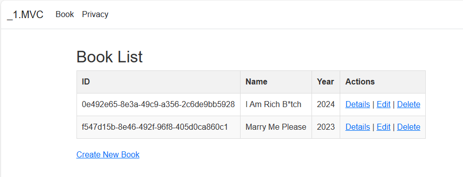
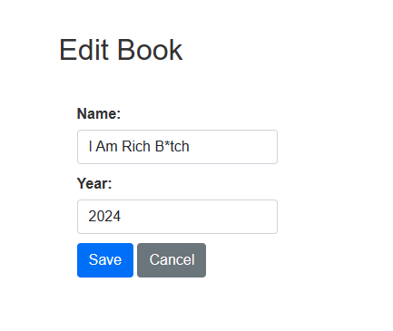

# MVC

Knowledge cover: APS.NET core MVC(CRUD book entity) + razor page + razor components.

MVC is an architectural design pattern used for developing applications, specifically web applications. This pattern separates an application into three main logical components Model View Controller. Each architectural component is built to handle specific development aspects of an application.

- Model - Handles all data-related logic. Interacts with Database.
- View - Handles UI part of the applications (data presentation).
- Controller - Handles request flow, and acts as an intermediary between view and model.

| Number | image                                                                 |
| ------ | --------------------------------------------------------------------- |
| 1      |  |
| 2      |  |
| 3      |  |
| 4      |  |
| 5      |  |
